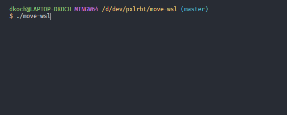

# Move WSL

Bash, batch and PowerShell script to move WSL 1 and WSL 2 distros VHDX file to a different location.



## Usage

### Bash
Use with git bash for Windows or similiar.

#### Interactive way
1) `./move-wsl`
2) Select your distro
3) Enter your target (i.e. `/d/wsl target/ubuntu`)

#### Explicit way
1) Get a list of WSL distros: `wsl -l`
2) Move your image: `./move-wsl [NAME] [LOCATION]`

__Example:__ `./move-wsl docker-desktop /d/docker`


### PowerShell
Interactive way of moving wsl for Windows PowerShell.

1) `./move-wsl.ps1`
2) Select your distro
3) Enter your target (i.e. `D:\wsl target\ubuntu`)

### Batch
_This is a lightweight version_ which can also be used from Windows CMD.

1) Get a list of WSL distros: `wsl -l`
2) Move your image: `move-wsl.bat [NAME] [LOCATION]`

__Example:__ `move-wsl.bat docker-desktop "D:\wsl files\docker"`

## Moving Docker WSL

Before moving Docker WSL make sure to stop the Docker service. Otherwise Docker will crash and you may need to reset it to factory defaults.

## FAQ

### Default user was switched to root when moving a distro

Set your default user inside your distro by adding the following configuration to your `/etc/wsl.conf`.

```ini
[user]
default=YOUR_USERNAME
```

If the file doesn't exist create it manually. Then exit your distro, terminate it (`wsl -t YOUR_DISTRO`) and start it again. For further options see [Microsoft Docs](https://docs.microsoft.com/en-us/windows/wsl/wsl-config#user).

Some distributions also allow settings the default user via command line with `YOUR_DISTRO config --default-user YOUR_USER` (e.g. `ubuntu config --default-user johndoe`). Make sure to shutdown your distro before (`wsl -t YOUR_DISTRO`).

### Standard distro switched when moving it

Since we need to unregister to import it with the same name, the standard distro can be switched. Just set your standard distro again:

```sh
wsl -s YOUR_DISTRO
```

### WSL version was switched when moving distro

On import the distro will be registered with the current default WSL version. You can set your default WSL version with `wsl --set-default-version <Version>`.
When the WSL version was accidentally changed while moving, you can set the version with `wsl --set-version <Distro> <Version>`.
